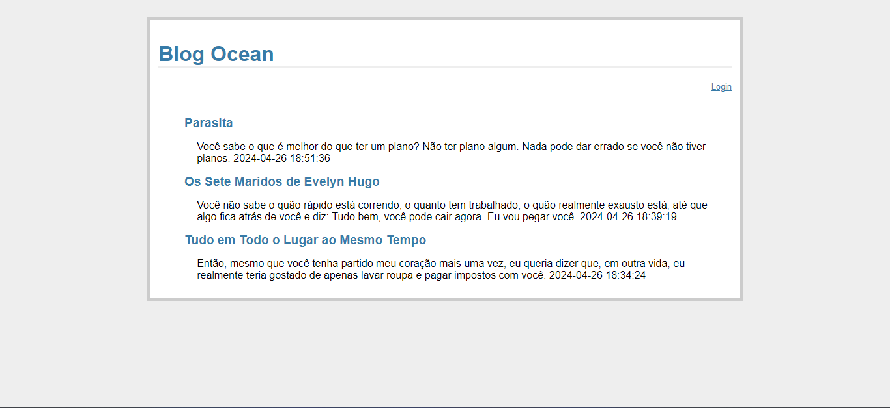

# Blog desenvolvido durante o Curso do Samsung Ocean

> Desenvolvimento de um blog

Desafio - Desenvolvimento de Blog
- Este projeto foi desenvolvido como parte do curso "Programando para web com Python, CSS e HTML" oferecido pela Samsung Ocean. O objetivo foi aplicar os conhecimentos adquiridos durante o curso na criação de um blog funcional. O projeto explora a integração de Flask, Python, HTML, CSS e SQLite, demonstrando minhas habilidades técnicas e de desenvolvimento web.

[🔗 Clique aqui para acessar o projeto](https://github.com/raquelfrancaa/WebPythonOcean)

## 🛠 Tecnologias Utilizadas

- Python
- Flask
- HTML
- CSS
- SQLite
- Git e GitHub